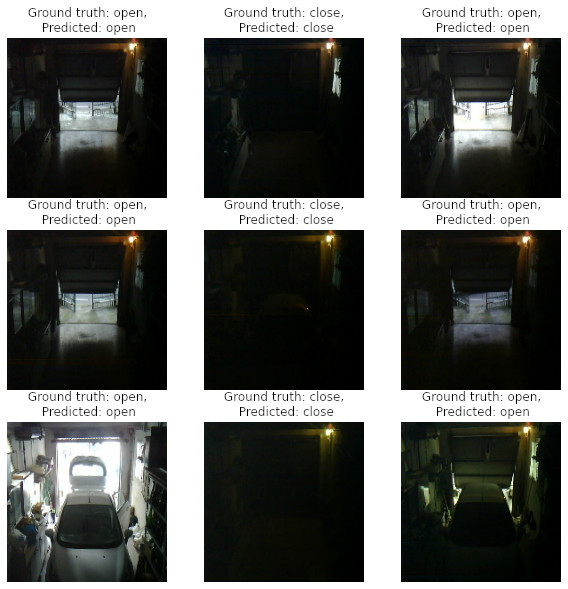

<div align="center">
<h1>CNN Garage | A CNN implemented in Tensorfow Lite to detect if the garage door is open or close</h1>
</div>

## Usage

```
usage: tflite_run.py [-h] [-i IMAGE] [-m MODEL_FILE]

optional arguments:
  -h, --help            show this help message and exit
  -i IMAGE, --image IMAGE
                        image to be classified
  -m MODEL_FILE, --model_file MODEL_FILE
                        .tflite model to be executed
```

## Example
The repository contains a pretrained tflite model (`model.tflite`) and a test image (`test.jpg`). Just run `./tflite_run.py`.

## Training results 

